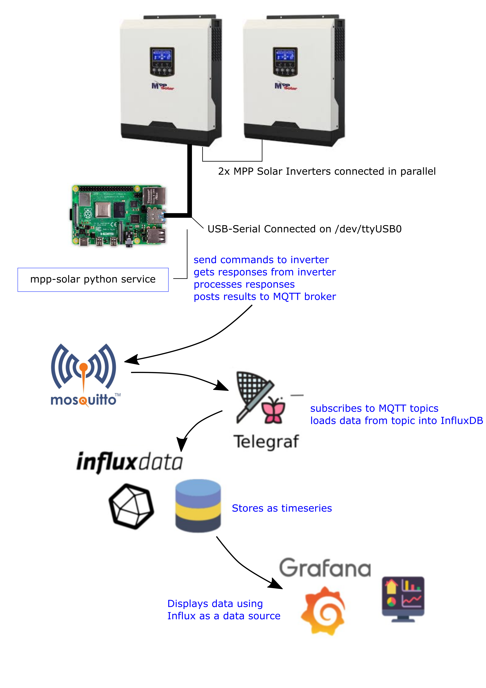

# MPP Solar Inverter - Connecting to local MQTT / Influx / Grafana #

Connecting to Grafana, as documented below uses a number of components / steps.


## Setting up a MQTT Broker on the Raspberry Pi ##
Note: while the below shows setting up the MQTT broker on the same device as is connected to the inverter, this is not needed, as long as the inverter connected Pi can communication with the MQTT broker the broker can be anywhere (including on the Inter-tubes). Just change the `-q localhost`.
Password secured brokers will need username and password supplied ` --mqttuser <username> --mqttpass <password>`

* Install Mosquitto `sudo apt install -y mosquitto mosquitto-clients`
* Set MQTT service to start on boot `sudo systemctl enable mosquitto.service`
* Start MQTT service now `sudo systemctl start mosquitto.service`

### Testing MQTT ###
* You will need two command windows open (called CMD1 and CMD2 below)
* In CMD1: start (verbosely) listening to all MQTT topics on the local broker `mosquitto_sub -h localhost -v -t "#"`
* In CMD2: send a test message `mosquitto_pub -h localhost -t "basetopic/subtopic" -m "this is the message"`
* The topic and message should display in CMD1
```
$ mosquitto_sub -h localhost -v -t "#"
basetopic/subtopic this is the message
```
* If the message displayed in CMD1 window the test has passed. yay!

* Test from mpp-solar, in CMD2 `mpp-solar -q localhost -c QID`
* This should display something in CMD1 similar to (the numbers will be different and should match your inverter serial number):
```
QID/serial_number/value 9293333010501
QID/serial_number/unit (null)
```

Now you can change the `QID` to any command (or multiple commands separated by commas but no spaces) that you wish to use

### Schedule Regular Queries (and MQTT message posts) ###
Use cron or similar to schedule the command to run on a regular basis
e.g. for cron
`crontab -e` to edit
and add a line like
```
* * * * * /usr/local/bin/mpp-solar -q localhost -c QPIGS -i > /home/pi/cron.out 2>&1
```
which will run the QPIGS command every minute and log errors to /home/pi/cron.out

or [setup](service-README.md) the mpp-solar service

## Install Influx ##
Source: https://simonhearne.com/2020/pi-influx-grafana/
Thanks SIMON HEARNE!!

* Add the influx repos
```
wget -qO- https://repos.influxdata.com/influxdb.key | sudo apt-key add -
source /etc/os-release
echo "deb https://repos.influxdata.com/debian $(lsb_release -cs) stable" | sudo tee /etc/apt/sources.list.d/influxdb.list
```
* Update apt and install influx
```
sudo apt update
sudo apt-get install influxdb
```
* Start influx and set to run at boot
```
sudo systemctl unmask influxdb.service
sudo systemctl start influxdb
sudo systemctl enable influxdb.service
```
* Run influx
```
influx
```
* add users etc
```
create database mppsolar
use mppsolar

create user grafana with password '<passwordhere>' with all privileges
grant all privileges on mppsolar to grafana

show users
```
* should display
```
user admin
---- -----
grafana true
```
* then exit
```
exit
```

## Install Grafana ##
* Add grafana repos
```
wget -q -O - https://packages.grafana.com/gpg.key | sudo apt-key add -
echo "deb https://packages.grafana.com/oss/deb stable main" | sudo tee /etc/apt/sources.list.d/grafana.list
```
* Update apt and install grafana
```
sudo apt update
sudo apt-get install grafana
```
* Start grafana and set to run at boot
```
sudo systemctl unmask grafana-server
sudo systemctl start grafana-server
sudo systemctl enable grafana-server
```

## Install Telegraf ##
`sudo apt-get install telegraf`

## Configure Telegraf ##

* Configure Telegraf
* Edit `/etc/telegraf/telegraf.conf`, find the line with `[[outputs.influxdb]]` and put a `#` at the start (i.e. comment out that line)
* In an new file `/etc/telegraf/telegraf.d/mqtt-input.conf` add these lines:
```
[[inputs.mqtt_consumer]]
  servers = ["tcp://127.0.0.1:1883"]
  topics = [
    "#",
  ]
  data_format = "influx"
```
_note: the topic "#" will listen to all mqtt topics, you will likely want to be more specific_


* In a new file `/etc/telegraf/telegraf.d/influx-output.conf` add these lines
```
[[outputs.influxdb]]
  urls = ["http://127.0.0.1:8086"]
  database = "mppsolar"
  skip_database_creation = true
  username = "grafana"
  password = "<put your password here>"
```

* Start telegraf and set to run at boot
```
sudo systemctl unmask telegraf.service
sudo systemctl start telegraf
sudo systemctl enable telegraf.service
```

## Log in to Grafana and Add Influx as a source ##

* Connect to Grafana by going to `http://<ipaddress>:3000` in a browser
* Log in with the username and password = admin and set a new admin password


### Troubleshooting ###
If you get an error `ImportError: No module named paho.mqtt.publish`
* Make sure paho-mqtt is installed
`sudo pip install paho-mqtt`

Check if influx is listening on right port
* `ss -lnapt |grep influx`
* if there isn't a LISTEN on 127.0.0.1 port 8086 - edit `/etc/influxdb/influxdb.conf`
```
  in session [http]
      bind-address = "127.0.0.1:8086"
```

To check what is stored in influx
* log in to influx `influx`
* at influx prompt use the DB created `use mppsolar`
* show all the 'tables' `show measurements`
* show entries in one table `select * from <table name goes here>` e.g. `select * from QPGS0`

* Show telegraf errors `sudo systemctl status telegraf`

* Show cron errors (if using cron and not the service)`cat /home/pi/cron.out`
* Show mpp-solar service errors `systemctl --user status mpp-solar`
