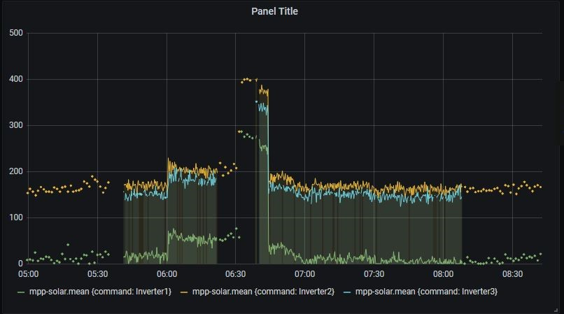

# Install on Ubuntu 20.04 #
__created / tested by Dalibor Majksner__

1. Install OS
2. Install updates
3. Do not ever install Python2 on Ubuntu 20.04. You will regret it.
4. Install python3 updates if any
5. Install python3-pip
6. Install MQTT
7. Install paho-mqtt
8. Install python3-systemd
9. Install InfluxDB
10. Install Telegraf
11. Install Grafana (follow install steps on Grafana.com)
12. Reboot for good luck!!!!!!
13. Most likely will have to disable power saving features for USB ports to
avoid issues in picture below. Does not have easy workaround or menu
settings.

14. Install mpp-solar from jblance github page. Follow instructions
