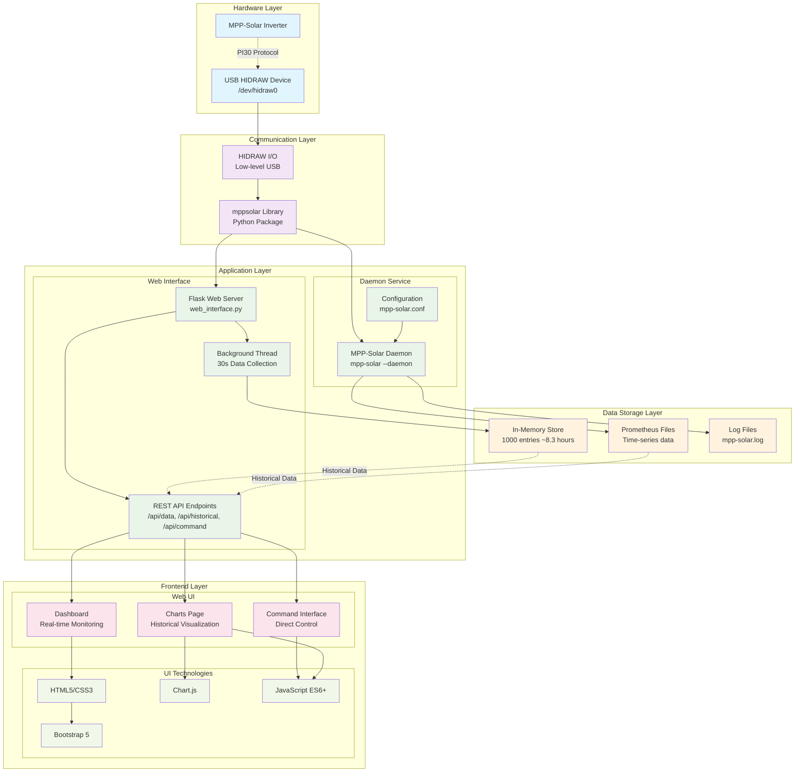
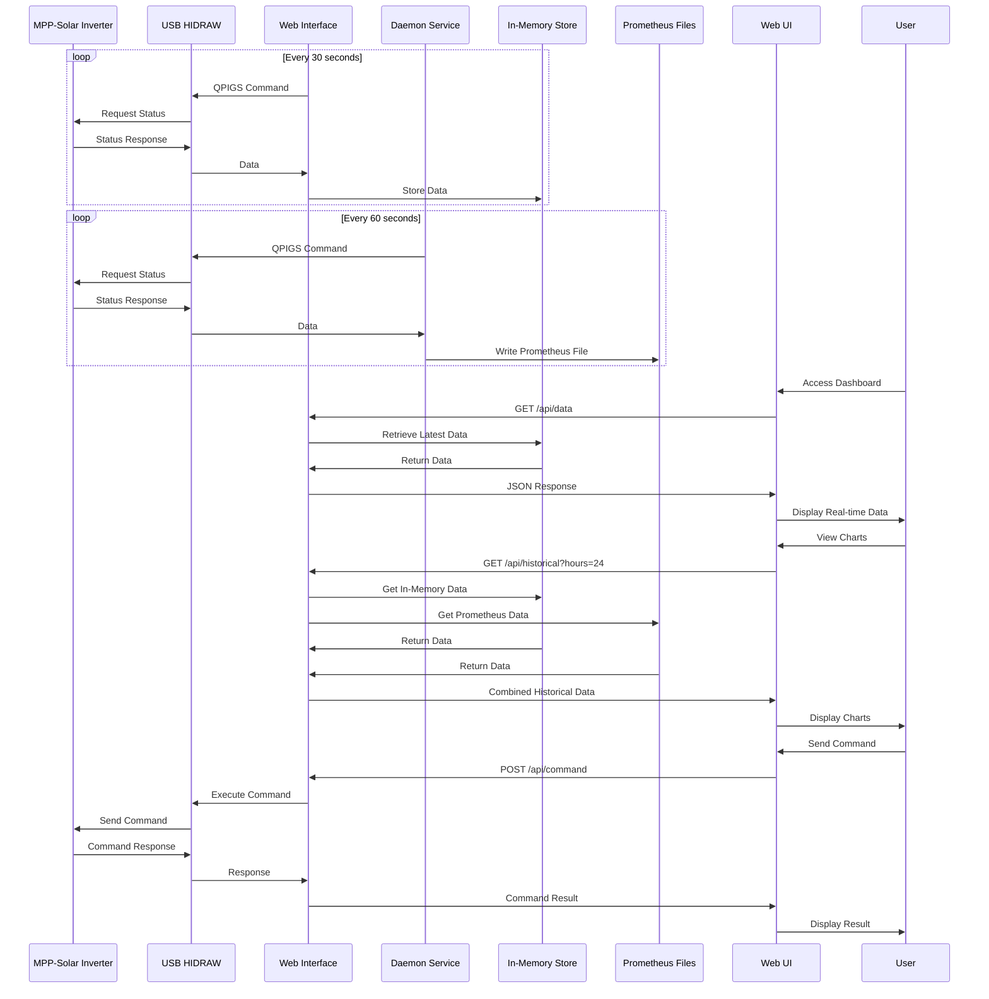
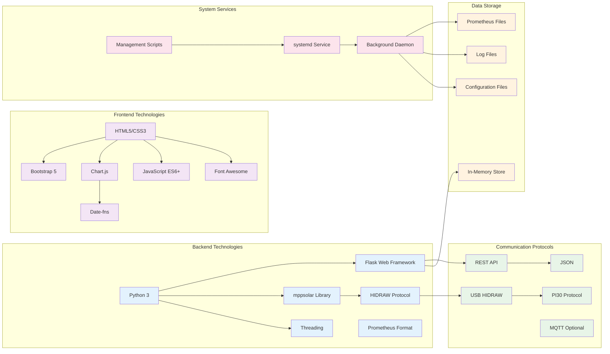

# MPP-Solar Project Architecture

## System Architecture Diagram



## Data Flow Diagram



## Technology Stack Diagram



## Component Interaction Diagram

```mermaid
graph TD
    subgraph "User Interface Layer"
        DASH[Dashboard Page<br/>Real-time Monitoring]
        CHARTS[Charts Page<br/>Historical Data]
        CMD[Command Interface<br/>Direct Control]
    end

    subgraph "API Layer"
        DATA_API[/api/data<br/>Current Status]
        HIST_API[/api/historical<br/>Historical Data]
        CMD_API[/api/command<br/>Command Execution]
    end

    subgraph "Business Logic Layer"
        GET_DATA[get_inverter_data<br/>Data Collection]
        GET_HIST[get_historical_data<br/>Data Retrieval]
        UPDATE_THREAD[update_data_thread<br/>Background Collection]
    end

    subgraph "Data Access Layer"
        DEVICE[Device Interface<br/>mppsolar Library]
        MEM_STORE[historical_data_store<br/>In-Memory Cache]
        PROM_FILES[Prometheus Files<br/>Persistent Storage]
    end

    subgraph "Hardware Layer"
        HIDRAW_DEV[HIDRAW Device<br/>/dev/hidraw0]
        INVERTER[MPP-Solar Inverter<br/>PI30 Protocol]
    end

    %% User Interactions
    DASH --> DATA_API
    CHARTS --> HIST_API
    CMD --> CMD_API

    %% API to Business Logic
    DATA_API --> GET_DATA
    HIST_API --> GET_HIST
    CMD_API --> DEVICE

    %% Business Logic to Data Access
    GET_DATA --> DEVICE
    GET_DATA --> MEM_STORE
    GET_HIST --> MEM_STORE
    GET_HIST --> PROM_FILES
    UPDATE_THREAD --> GET_DATA

    %% Data Access to Hardware
    DEVICE --> HIDRAW_DEV
    HIDRAW_DEV --> INVERTER

    %% Background Processes
    UPDATE_THREAD -.->|Every 30s| GET_DATA
    DAEMON_PROC[Daemon Process] -.->|Every 60s| DEVICE
    DAEMON_PROC -.->|Write| PROM_FILES

    %% Styling
    classDef ui fill:#e1f5fe
    classDef api fill:#f3e5f5
    classDef logic fill:#e8f5e8
    classDef data fill:#fff3e0
    classDef hardware fill:#fce4ec

    class DASH,CHARTS,CMD ui
    class DATA_API,HIST_API,CMD_API api
    class GET_DATA,GET_HIST,UPDATE_THREAD logic
    class DEVICE,MEM_STORE,PROM_FILES data
    class HIDRAW_DEV,INVERTER hardware
```
